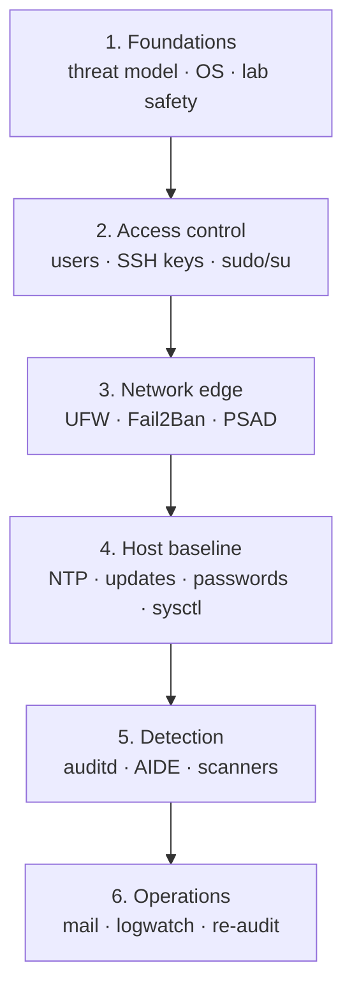
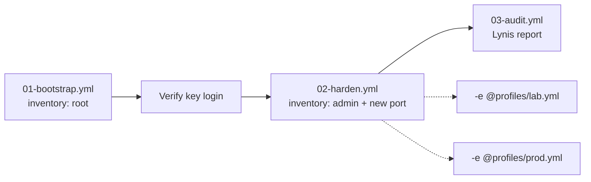

# Linux Server Hardening

[](LICENSE)
[](https://github.com/nowo-tech/LinuxServerHardening/actions/workflows/ci.yml)
[](https://docs.ansible.com/)
[](https://www.debian.org/)

**Linux Server Hardening** is a Nowo Tech learning kit: a layered security guide plus Ansible automation you can run on a fresh Debian host.

It is written for people who want to **understand each control**, not only apply a checklist. Every chapter follows the same pattern:

1. **Threat** — what goes wrong if you skip this
2. **Do** — concrete commands or playbook tags
3. **Why** — the reasoning in plain language
4. **Verify** — how to prove the control works
5. **Rollback** — how to undo it safely

## Who this is for

- Operators bringing up VPS or bare-metal Debian servers
- Developers who own a small production box end-to-end
- Teams that want a repeatable baseline before app deploy

It is **not** a compliance product, a CIS auditor replacement, or a substitute for your organisation’s security policy.

## Mental model: six defense layers

Work **bottom-up**. Changing SSH before you have a firewall recovery path is a common lock-out pattern.



## Automation flow

Always pick a profile: **lab** (disposable) or **prod** (real `ignoreip`, strict ops).



## Repository layout

```text
docs/                 Didactic guide (read in order)
ansible/
  playbooks/          bootstrap → harden → audit
  roles/              one concern per role
  inventories/lab/    bootstrap vs runtime host files
  inventories/prod/   production inventory skeletons
  group_vars/         non-secret defaults + vault placeholders
  profiles/           lab.yml / prod.yml overlays (required on harden)
```

| Path | Purpose |
|------|---------|
| [docs/00-start-here.md](docs/00-start-here.md) | How to use the kit safely |
| [docs/01-foundations/](docs/01-foundations/) | Threat model, OS choice, lab safety |
| [docs/02-access-control/](docs/02-access-control/) | Users, SSH (crypto + MFA), privileges |
| [docs/03-network/](docs/03-network/) | Firewall, IDS, Docker caveats, CrowdSec |
| [docs/04-host-baseline/](docs/04-host-baseline/) | NTP, updates, passwords, kernel knobs |
| [docs/05-detection/](docs/05-detection/) | auditd, AIDE, malware/rootkit checks |
| [docs/06-operations/](docs/06-operations/) | Mail, digests, monitoring/healthchecks, CI/CD contract, day-2 review |
| [docs/07-advanced/](docs/07-advanced/) | AppArmor, FIDO2, GRUB, umask, more |
| [docs/CONTROL-COVERAGE.md](docs/CONTROL-COVERAGE.md) | Documented vs automated map |
| [ansible/README.md](ansible/README.md) | How to run the playbooks |

## Quick start (automation)

> **Warning:** These playbooks change SSH, firewall, and privilege settings. Use a disposable lab VM first. Keep a console/VNC session open until you confirm key-based login on the new port.

```bash
git clone https://github.com/nowo-tech/LinuxServerHardening.git
cd LinuxServerHardening/ansible

# 1) Inventories: bootstrap (root) vs runtime (admin + new SSH port)
cp inventories/lab/hosts.bootstrap.yml.example inventories/lab/hosts.bootstrap.yml
cp inventories/lab/hosts.yml.example inventories/lab/hosts.yml
# Edit both: set ansible_host; align ansible_user/port in hosts.yml with vars

# 2) Variables + Vault secrets
cp group_vars/all/vars.yml.example group_vars/all/vars.yml
cp group_vars/all/vault.yml.example group_vars/all/vault.yml
ansible-vault encrypt group_vars/all/vault.yml

# 3) Bootstrap admin user + SSH key (as root once)
ansible-playbook -i inventories/lab/hosts.bootstrap.yml playbooks/01-bootstrap.yml \
  --ask-vault-pass --ask-pass -e @profiles/lab.yml

# 4) Harden — pick ONE overlay (required)
# Lab (disposable VM):
ansible-playbook -i inventories/lab/hosts.yml playbooks/02-harden.yml \
  --ask-vault-pass --ask-become-pass --key-file ~/.ssh/lab_ed25519 \
  -e @profiles/lab.yml

# Production (edit profiles/prod.yml first: real ignoreip, not REPLACE_ME):
# ansible-playbook -i inventories/lab/hosts.yml playbooks/02-harden.yml \
#   --ask-vault-pass --ask-become-pass --key-file ~/.ssh/id_ed25519 \
#   -e @profiles/prod.yml
```

Without `-e @profiles/lab.yml` or `-e @profiles/prod.yml`, harden **fails** (`harden_profile` required). Lab relaxes ignoreip; prod **requires** a real `harden_fail2ban_ignoreip` (no empty / TEST-NET / `REPLACE_ME_*` values). Vault must not contain `CHANGE_ME_*` for **admin/SMTP** (always); GHA/webhook secrets are checked only when those features are enabled.

Re-runs (runtime inventory already sets `ansible_port`):

```bash
ansible-playbook -i inventories/lab/hosts.yml playbooks/02-harden.yml \
  --ask-vault-pass --ask-become-pass --key-file ~/.ssh/lab_ed25519 \
  -e @profiles/lab.yml
```

## Quick start (manual learning path)

1. Read [docs/00-start-here.md](docs/00-start-here.md)
2. Complete [docs/01-foundations/](docs/01-foundations/)
3. Follow layers 2 → 6 in order
4. Use the playbooks as a regression suite for the same controls

## Design choices (and why)

| Choice | Reason |
|--------|--------|
| Debian 12/13 only (asserted) | Predictable packaging and systemd behaviour |
| Ansible Vault for secrets | Passwords and SMTP tokens must not live in git history |
| Lab / prod profiles | Same roles; different lockout and strictness knobs |
| Fail2Ban ignoreip required by default | Prevents banning your own admin IP on public hosts |
| No NOPASSWD / auto-reboot / PSAD AUTO_IDS by default | Safer production posture |
| Default-deny firewall (in and out) | Limits scanners and unexpected C2 egress |
| Key-only SSH, no root login | Removes the highest-value, most-probed credentials |
| Separate bootstrap vs runtime inventories | Avoids `ansible_user: root` sticking on harden plays |

## Safety contract

- Read each role before enabling it on a machine that matters.
- Automation is a **starting baseline**, not a finished security program.
- You own verification: open a second session, test login, test firewall, test mail.
- Production needs backups, **monitoring/healthchecks**, an **incident plan**, and a **CI/CD contract** that respects hardened SSH/UFW — see [docs/06-operations/monitoring-and-healthchecks.md](docs/06-operations/monitoring-and-healthchecks.md) and [docs/06-operations/cicd-and-deploy.md](docs/06-operations/cicd-and-deploy.md).

## Contributing

See [CONTRIBUTING.md](CONTRIBUTING.md). Keep documentation didactic: every new control needs Threat / Do / Why / Verify / Rollback.

## License

MIT — see [LICENSE](LICENSE).
