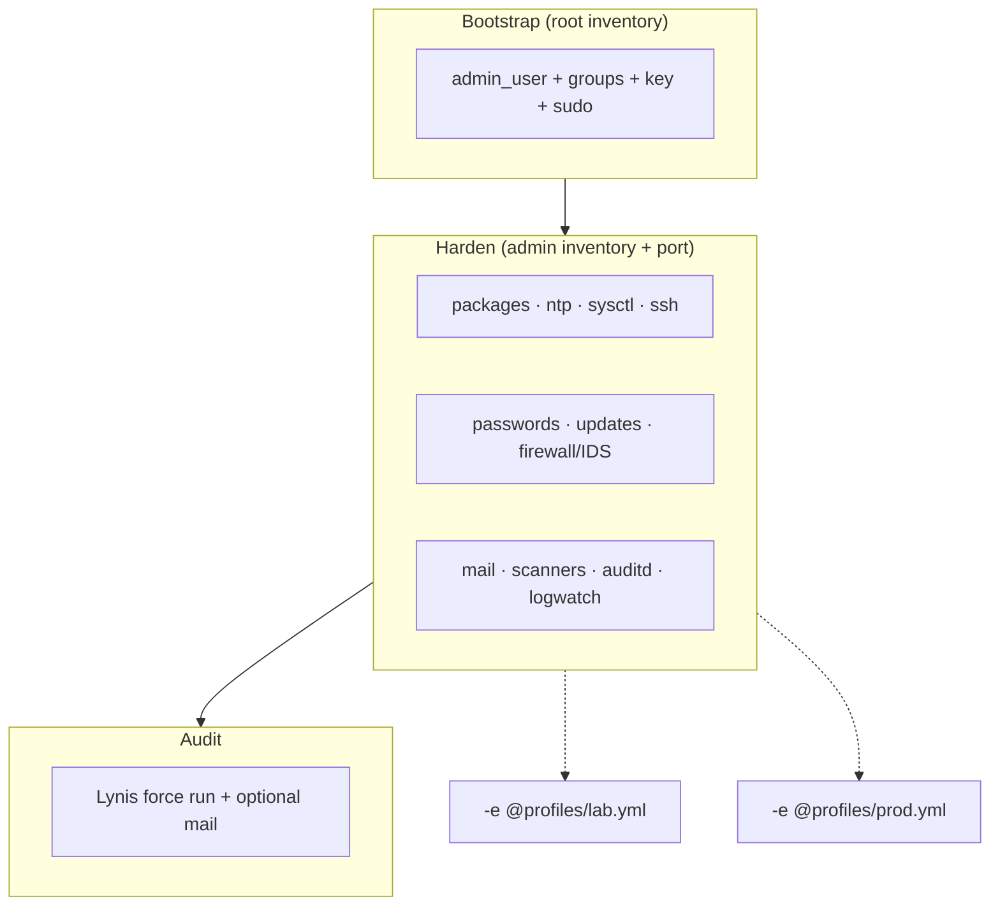

# Ansible automation

Playbooks mirror the documentation layers. Read [../docs/00-start-here.md](../docs/00-start-here.md) and [../docs/CONTROL-COVERAGE.md](../docs/CONTROL-COVERAGE.md) before the first run.

## Requirements

- Control node: Ansible 2.14+ (`ansible.posix`, `community.general`)
- Target: **Debian 12 or 13** (asserted in plays)
- Console/VNC available until key login on the new port is verified

```bash
ansible-galaxy collection install -r requirements.yml
```

## Configure

```bash
cd ansible
cp inventories/lab/hosts.bootstrap.yml.example inventories/lab/hosts.bootstrap.yml
cp inventories/lab/hosts.yml.example inventories/lab/hosts.yml
cp group_vars/all/vars.yml.example group_vars/all/vars.yml
cp group_vars/all/vault.yml.example group_vars/all/vault.yml
ansible-vault encrypt group_vars/all/vault.yml
```

**Inventory rule:** `ansible_user` in inventory overrides play `remote_user`. Use bootstrap inventory for `01-bootstrap.yml` and runtime inventory for harden/audit.

## Plays



| Playbook | Inventory | Purpose |
|----------|-----------|---------|
| `01-bootstrap.yml` | `hosts.bootstrap.yml` (root) | Admin user, groups, key, sudo |
| `02-harden.yml` | `hosts.yml` (admin + port) | Baseline hardening |
| `03-audit.yml` | `hosts.yml` | Lynis report (forces audit run; vault optional) |

## Safer defaults

Outside `-e @profiles/lab.yml`, Fail2Ban **requires** a real `harden_fail2ban_ignoreip`, and `harden_strict_ops` turns mail/PSAD/Lynis soft-fails into hard failures.

```bash
# Disposable lab
ansible-playbook -i inventories/lab/hosts.yml playbooks/02-harden.yml \
  --ask-vault-pass --ask-become-pass -e @profiles/lab.yml

# Production (edit profiles/prod.yml: real ignoreip, not REPLACE_ME)
ansible-playbook -i inventories/lab/hosts.yml playbooks/02-harden.yml \
  --ask-vault-pass --ask-become-pass -e @profiles/prod.yml
```

| Knob | Default (`vars.yml`) | Lab profile | Prod profile |
|------|----------------------|-------------|--------------|
| `harden_fail2ban_require_ignoreip` | `true` | `false` | `true` |
| `harden_strict_ops` | `true` | `false` | `true` |
| `harden_passwordless_sudo` | `false` | `true` | `false` |
| `harden_auto_reboot` | `false` | `true` | `false` |
| `harden_ssh_keys_exclusive` | `false` | — | `true` |

## Tags

`packages`, `ntp`, `sysctl`, `ssh`, `mfa`, `passwords`, `updates`, `firewall`, `ids`, `mail`, `malware`, `integrity`, `chkrootkit`, `aide`, `auditd`, `logwatch`, `lynis`.

## Check mode / Molecule

`--check` is best-effort. Tasks that shell out (moduli trim, aideinit, lynis, psad signature update, test mail) are not fully check-safe.

Optional smoke test (Docker required; also runs in CI):

```bash
cd ansible
pip install 'molecule' 'molecule-plugins[docker]'
molecule test
```

## Directory map

```text
roles/
  bootstrap/ admin_user/ time_sync/ host_sysctl/
  ssh_hardening/ ssh_mfa/ password_policy/ auto_updates/
  firewall_stack/ outbound_mail/
  malware_scan/ integrity_checks/ rootkit_extra/ file_integrity/
  audit_framework/ log_digest/ security_audit/
profiles/
  lab.yml   prod.yml
```
