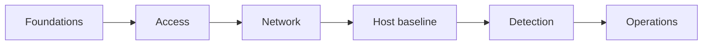
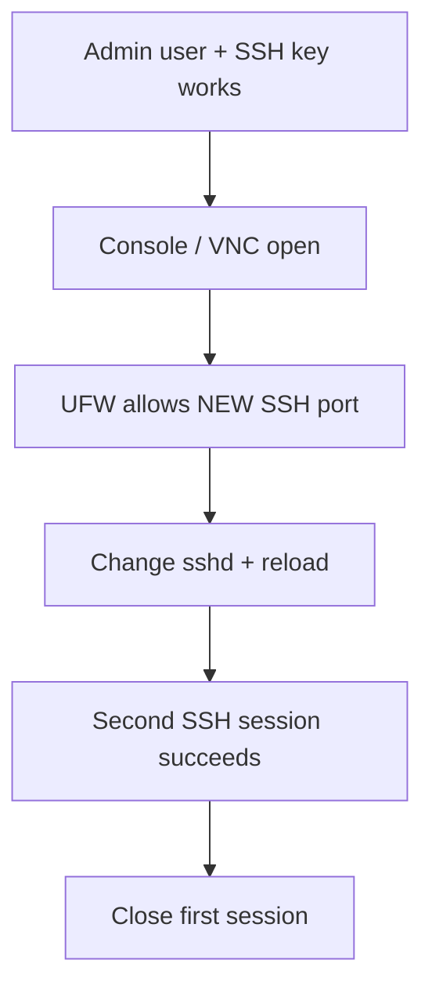

# Start here

This kit teaches **why** Linux server controls exist, then helps you apply them by hand or with Ansible.

## Before you touch a production host

1. **Snapshot or clone a lab VM.** Prefer a throwaway VPS or local QEMU/VirtualBox image.
2. **Open a provider console** (serial, VNC, or cloud “recovery”). If SSH breaks, you still have a way in.
3. **Write down recovery facts:** current SSH port, root password (lab only), admin username, public key path.
4. **Decide your threat model** using [01-foundations/threat-model.md](01-foundations/threat-model.md).

## How each chapter is structured

| Section | Question it answers |
|---------|---------------------|
| Threat | What fails if we skip this? |
| Do | What exact steps do I take? |
| Why | Why this setting and not another? |
| Verify | How do I prove it worked? |
| Rollback | How do I undo without rebuilding? |

Where automation exists, chapters mention the matching Ansible **tags** / roles.

## Suggested order

Skipping ahead is fine for experienced operators, but **never** change the SSH port until the anti-lockout path below is true.

## Lab vs production

| Topic | Lab (`profiles/lab.yml`) | Production (`profiles/prod.yml`) |
|-------|--------------------------|----------------------------------|
| Profile required on harden | Yes (`harden_profile: lab`) | Yes (`harden_profile: prod`) |
| Secrets in Vault | Recommended (no `CHANGE_ME_*`) | Mandatory |
| Fail2Ban `ignoreip` | Optional | **Required** (real CIDRs, not TEST-NET) |
| `harden_strict_ops` | Off (soft-fail OK) | On (mail/PSAD/Lynis must work) |
| Passwordless sudo | Allowed | Off |
| Auto-reboot after security updates | Allowed | Off / windowed |
| ClamAV / AIDE / chkrootkit | Often on | Opt-in by load |
| Default-deny egress | Recommended | Required if you can list needed ports |
| Harden as root inventory | Refused (override only) | Refused |
| node_exporter / health_watchdog / Monit | On (lab profile) | Off until opted in |
| GHA runner / webhook deploy | Off until tokens configured | Off until opted in |

## What “good enough” looks like after day one

- Root cannot SSH in
- Password SSH is off; keys only
- Only members of an SSH allow-group can connect
- Firewall denies unexpected inbound traffic
- Fail2Ban has an admin/VPN allowlist (prod)
- Security updates install without waiting for you
- You receive at least one test alert email

Then iterate: detection depth, MFA enforce, kernel hardening, and continuous audit.

## Next

Continue with [01-foundations/principles.md](01-foundations/principles.md).
