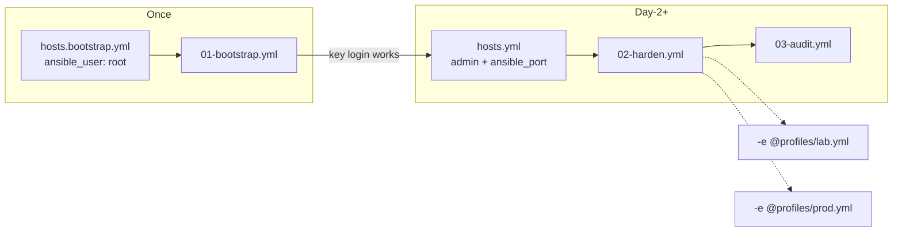

# Lab setup

## Threat

Learning hardening on the only production server is how teams lock themselves out and then permanently weaken SSH “so it never happens again.”

## Do

### Option A — local VM

1. Install Debian 12 or 13 (server profile, OpenSSH enabled).
2. Give the VM a bridged or host-only NIC you can reach.
3. Take a snapshot named `pre-hardening`.

### Option B — cloud VPS

1. Create the smallest Debian image.
2. Confirm provider web console works **before** changing SSH.
3. Prefer a floating IP so rebuilds keep the same address in your inventory.

### Shared prep on the control machine (your laptop)

```bash
# Modern key type; empty passphrase only for disposable labs
ssh-keygen -t ed25519 -a 100 -f ~/.ssh/lab_ed25519 -C "lab-hardening"

# First login as root/password (provider default) — lab only
ssh-copy-id -i ~/.ssh/lab_ed25519.pub root@SERVER_IP
```

Install Ansible on the control machine (not necessarily on the target):

```bash
# Debian/Ubuntu control node example
sudo apt update
sudo apt install -y ansible ansible-core
ansible --version
```

### Inventory sketch

Use **two** inventories. `ansible_user` in inventory wins over play `remote_user`, so a leftover `root` entry breaks harden/audit plays.



```yaml
# inventories/lab/hosts.bootstrap.yml  — first run only
ansible_user: root

# inventories/lab/hosts.yml  — after bootstrap
ansible_user: admin
ansible_port: 2222
```

Always pass a profile overlay when hardening:

```bash
# Disposable lab
-e @profiles/lab.yml

# Real host (edit ignoreip in profiles/prod.yml first)
-e @profiles/prod.yml
```

## Why

Separating **control node** and **target** matches how you will operate later: automation runs from CI or an admin workstation, not from the box being locked down.

Snapshots and consoles turn irreversible mistakes into five-minute recoveries, which makes you brave enough to use default-deny firewalls.

## Verify

```bash
ssh -i ~/.ssh/lab_ed25519 root@SERVER_IP 'uname -a && cat /etc/os-release | head -3'
# After copying hosts.bootstrap.yml with your IP:
ansible -i inventories/lab/hosts.bootstrap.yml lab-debian -m ping --key-file ~/.ssh/lab_ed25519
```

You want `pong` and a Debian version string.

## Rollback

Restore the `pre-hardening` snapshot, or rebuild the VPS from the provider image. Do not debug a half-applied harden play on a machine you care about.

## Next

[../02-access-control/admin-identity.md](../02-access-control/admin-identity.md)
