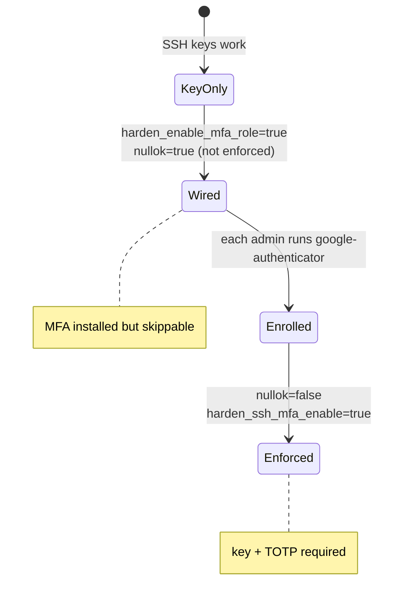

# SSH multi-factor authentication (TOTP)

## Threat

A stolen laptop with an unlocked SSH private key (or an exported key without a passphrase) is enough to enter a key-only host. A second factor bound to the admin’s phone or hardware token stops that single-secret failure mode.

## Do

Complete **key-only SSH** first. Never enable MFA in the same change window as a port or firewall cutover.



```bash
apt install -y libpam-google-authenticator

# As each admin user (not as root):
google-authenticator
# Answer yes to time-based tokens, rate limiting, and scratch codes.
# Store scratch codes offline.
```

PAM (`/etc/pam.d/sshd`) — start with `nullok` so users can still log in before enrolment:

```text
auth required pam_google_authenticator.so nullok
```

sshd drop-in extras:

```text
KbdInteractiveAuthentication yes
AuthenticationMethods publickey,keyboard-interactive
```

Validate and reload:

```bash
sshd -t && systemctl reload ssh
```

After every admin has enrolled, remove `nullok` so unenrolled accounts cannot skip TOTP.

### Ansible

```bash
# 1) Wire PAM only (still allows login without TOTP while nullok is true)
#    vars: harden_enable_mfa_role: true, harden_ssh_mfa_nullok: true, harden_ssh_mfa_enable: false
ansible-playbook ... playbooks/02-harden.yml --tags mfa

# 2) Each admin runs: google-authenticator

# 3) Enforce key + TOTP (PAM without nullok + AuthenticationMethods)
#    vars: harden_ssh_mfa_nullok: false, harden_ssh_mfa_enable: true
ansible-playbook ... playbooks/02-harden.yml --tags mfa,ssh
```

Until step 3, MFA is **installed but not enforced** — do not treat that as 2FA complete.

## Why

| Mode | Effect |
|------|--------|
| Password + TOTP | Still allows password guessing; avoid on Internet SSH |
| Public key + TOTP | Stolen key alone is insufficient |
| `nullok` during rollout | Prevents lockout while people enrol |

Hardware keys (FIDO2) are an excellent alternative where your OpenSSH build and clients support `PubkeyAuthentication` with resident keys; TOTP is the portable baseline.

## Verify

```bash
ssh -p 2222 admin@SERVER   # should prompt for verification code after key
journalctl -u ssh -n 30 --no-pager
```

## Rollback

```bash
# Remove AuthenticationMethods and set KbdInteractiveAuthentication no
# Delete the pam_google_authenticator line
sshd -t && systemctl reload ssh
```

## Next

[../03-network/firewall.md](../03-network/firewall.md)
