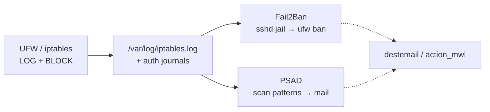

# Intrusion signals: Fail2Ban and PSAD

## Threat

Firewalls drop packets silently. You still want **signals**: repeated auth failures, port scans, and patterns that look like reconnaissance. Without alerts or automatic bans, you learn about abuse only after damage.

## Do

Signal path (order matters — logging before analysis):



### Fail2Ban (application log bans)

```bash
apt install -y fail2ban

# /etc/fail2ban/jail.local
[DEFAULT]
ignoreip = 127.0.0.1/8 ::1 203.0.113.10
# ↑ put YOUR admin/VPN CIDRs — never leave this empty on a public host
bantime  = 1h
findtime = 10m
maxretry = 5
destemail = security@example.com
sender = server@example.com
action = %(action_mwl)s

[sshd]
enabled = true
port = 2222
backend = systemd
banaction = ufw
```

```bash
systemctl enable --now fail2ban
fail2ban-client status sshd
```

### PSAD (firewall log analysis)

PSAD watches firewall logs for scan-like behavior. Wire UFW/iptables logging first, then:

```bash
apt install -y psad

# Point EMAIL_ADDRESSES and HOSTNAME in /etc/psad/psad.conf
# Enable watchd / auto-IDS only after mail works — or you get silent "protection"

systemctl enable --now psad
psad --Status
```

Ensure UFW logs dropped traffic so PSAD has input. Tune danger levels carefully; aggressive auto-block can ban your own CI runners.

### Dedicated firewall log file

Attach rate-limited `LOG` rules to **`ufw-after-input` / `ufw-after-forward`** (and IPv6 equivalents) so only packets **not** already ACCEPTed are logged (prefix `[IPTABLES] `). Ship those lines plus `[UFW BLOCK]` to `/var/log/iptables.log`, point PSAD `IPT_SYSLOG_FILE` there, and rotate daily. Logging on `ufw-before-*` would also record allowed traffic and flood PSAD. The Ansible `firewall_stack` role migrates away from legacy before-chain hooks automatically.

### CrowdSec (optional alternative)

On newer fleets, CrowdSec can replace or complement Fail2Ban with shared signals. See [crowdsec.md](crowdsec.md). Pick **one** primary bouncer stack first to avoid double-ban complexity.

## Why

| Tool | Strength |
|------|----------|
| Fail2Ban | Excellent at “same IP keeps failing sshd” |
| PSAD | Better at raw packet/scan patterns from firewall logs |
| CrowdSec | Community signals + modern scrapers |

They overlap. Start with Fail2Ban for SSH; add PSAD when logging is solid.

## Verify

From another host (not your only admin IP):

```bash
# Generate a few failed logins intentionally, then:
fail2ban-client status sshd
journalctl -u fail2ban -n 50 --no-pager
```

Confirm you receive mail only after the outbound mail chapter works.

## Rollback

```bash
fail2ban-client set sshd unbanip A.B.C.D
systemctl stop fail2ban
# PSAD:
systemctl stop psad
```

## Next

[docker-and-firewall.md](docker-and-firewall.md)
