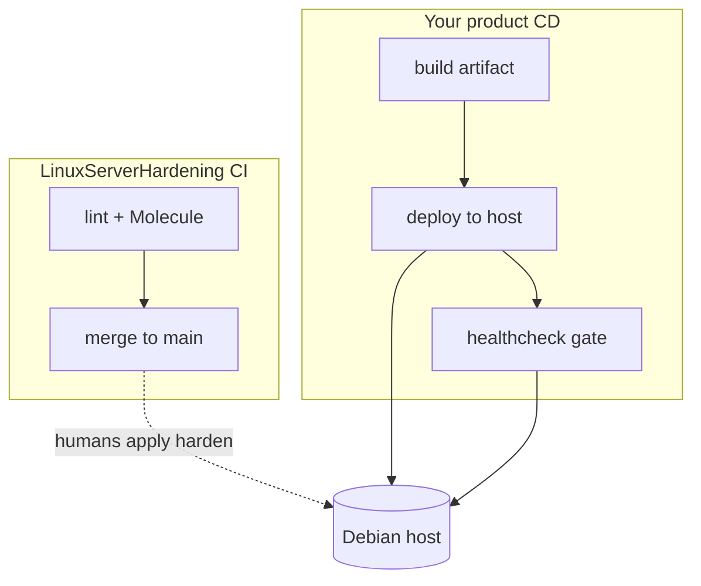

# CI/CD and automated deploys onto hardened hosts

## Threat

Pipelines that “just SSH as root on port 22” fight this kit. Equally dangerous: CI runners that share the same IP as attackers and get Fail2Ban’d mid-deploy, or secrets pasted into plain job logs.

## Do

### What this repository already automates

| Piece | Role |
|-------|------|
| GitHub Actions (this repo) | Syntax, yamllint, ansible-lint, Molecule smoke — **not** production deploys |
| `01-bootstrap` / `02-harden` / `03-audit` | Operator-driven from a control node (laptop/CI) with Vault |

Treat **kit CI** as quality gates for the playbooks. Treat **your app CI/CD** as a separate pipeline that must respect the hardened posture.



### Inventory and SSH for deploy jobs

1. Use the **runtime** inventory (`ansible_user=admin`, `ansible_port` = hardened port) — never leave `root` after bootstrap.
2. Deploy key or CI SSH key: **ed25519**, dedicated principal, in `AllowGroups` / `authorized_keys` only for that purpose.
3. Prefer `ansible_ssh_private_key_file` from a CI secret store — not a checkout of `id_rsa`.
4. If MFA is **enforced** for humans, use a **separate** deploy account with key-only and **no** interactive MFA, or use a short-lived certificate authority — do not disable MFA globally for convenience.

### Fail2Ban / UFW and runners

- Put **stable** runner egress CIDRs in `harden_fail2ban_ignoreip` (prod profile). Ephemeral GitHub-hosted runners change IPs — prefer self-hosted runners with fixed egress, or a bastion.
- Open only the deploy path you need (SSH on the hardened port, or HTTPS to a deploy agent). Do not “ufw allow 22” for CI.
- Default-deny **egress** on the host: allow the registries, package mirrors, and APIs your build/deploy truly needs (same discipline as [firewall](../03-network/firewall.md)).

### Suggested CD health gate

After deploy, fail the job unless the service is healthy:

```bash
# Example gate in your pipeline (runs against the environment URL)
curl -fsS --retry 5 --retry-all-errors --max-time 10 \
  "https://${APP_HOST}/healthz" >/dev/null
```

Pair with [monitoring-and-healthchecks.md](monitoring-and-healthchecks.md) so the same URL pages humans when CD is not running.

### Ansible from CI (optional pattern)

```bash
# Control node = CI job with network path to the host
ansible-galaxy collection install -r requirements.yml
ansible-playbook -i inventories/prod/hosts.yml playbooks/02-harden.yml \
  --vault-password-file "${VAULT_PASS_FILE}" \
  -e @profiles/prod.yml \
  --tags firewall,updates
```

Rules of thumb:

- Store Vault password and SSH keys in the CI secret manager; never echo them.
- Pin collection versions (`requirements.yml`) — same as this repo.
- Start with `--check` / tag-limited runs on production.
- Molecule in **this** repo does not replace staging deploys of **your** app.

### What not to automate from CD

- Interactive MFA enrolment
- Blind `ufw reset`
- Enabling PSAD `AUTO_IDS` or passwordless sudo “so the pipeline is easier”
- Third-party Lynis repos without an explicit supply-chain decision

## Why

Hardening and delivery share the same SSH port and firewall. Documenting the contract prevents the classic failure mode: security baseline on Monday, CI “temporary” holes on Tuesday that never leave.

## Verify

- A dry-run job connects as the deploy user on the **hardened** port and runs `ansible -m ping`.
- A failed healthcheck fails the pipeline (force a bad `/healthz` in lab).
- Runner IPs do not accumulate Fail2Ban bans during a normal deploy window.
- CI logs contain no Vault passwords or private keys (`grep` the job output in lab).

## Rollback

Revoke the deploy key, remove runner CIDRs from `ignoreip` if abandoned, and revert pipeline SSH config to the last known-good port/user. Re-run harden tags only after inventory matches reality.

## Next

[continuous-review.md](continuous-review.md) · [../../ansible/README.md](../../ansible/README.md)
