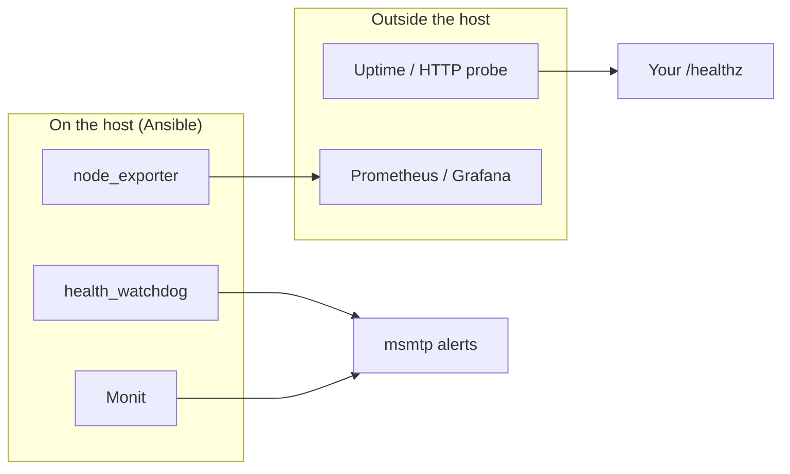

# Monitoring and healthchecks

## Threat

A hardened host that is **down**, **disk-full**, or **silently dropping mail** looks “secure” until customers notice. Host IDS (Fail2Ban, PSAD, Lynis mail) answers “are we under attack?” — not “is the service alive?”

## Do

### Ansible toggles (idempotent install / stop / remove)

The `monitoring_stack` role **always** runs on harden. Each tool is independent:

| Variable | Default | When `true` | When `false` |
|----------|---------|-------------|--------------|
| `harden_enable_node_exporter` | `false` | Install + start `prometheus-node-exporter` | Stop + purge package |
| `harden_enable_health_watchdog` | `false` | Install systemd timer + `/usr/local/sbin/nowo-health-watchdog` | Remove script + units |
| `harden_enable_monit` | `false` | Install + start Monit with baseline checks | Stop + purge + remove drop-ins |

Lab profile turns all three **on**; prod leaves them **off** until you opt in.

```bash
# Enable metrics + watchdog only
ansible-playbook -i inventories/prod/hosts.yml playbooks/02-harden.yml \
  --ask-vault-pass -e @profiles/prod.yml --tags monitoring \
  -e harden_enable_node_exporter=true \
  -e harden_enable_health_watchdog=true \
  -e harden_enable_monit=false

# Later: uninstall node_exporter (idempotent)
ansible-playbook ... --tags node_exporter -e @profiles/prod.yml \
  -e harden_enable_node_exporter=false
```

**node_exporter defaults:** listen `127.0.0.1:9100`. Set `harden_node_exporter_ufw_allow: true` and `harden_node_exporter_allow_from` only if a remote scraper must pull. A systemd drop-in adds `ProtectSystem=strict` and related sandbox flags.

**Health watchdog:** systemd timer (`harden_health_watchdog_oncalendar`, default `*:0/5`) runs a oneshot unit with sandboxing. Checks disk % (`harden_health_disk_threshold_pct`), `systemctl --failed`, optional `harden_health_probe_urls`, and mails via `harden_mail_to` when `harden_health_watchdog_mail: true`. Legacy `/etc/cron.d/nowo-health-watchdog` is removed on enable.

**Monit:** system/load/memory/cpu, root filesystem, `sshd` on `harden_ssh_port` (**alert only** — no start/stop), and node_exporter when that flag is on. Mail goes through **local msmtp** (`set mailserver localhost`) so the SMTP password stays only in `/etc/msmtprc`. A systemd drop-in uses `ProtectSystem=full` (not strict) so Monit can still manage sibling units.

Tags: `monitoring`, `metrics`, `node_exporter`, `health`, `health_watchdog`, `monit`.



### External uptime probes (still operator-owned)

Probe from a **different network** than the server. Allowlist probe CIDRs in Fail2Ban `ignoreip`.

| Check | Example | Notes after hardening |
|-------|---------|------------------------|
| TCP open | `nc -zv HOST 443` | Only ports you **allow in** UFW |
| TLS + HTTP | `curl -fsS https://HOST/healthz` | App must expose a cheap path |

### Minimum production checklist

```text
[ ] Decide which of node_exporter / watchdog / monit are enabled
[ ] External HTTP(S) probe with alert path tested once
[ ] Probe / scrape CIDRs in Fail2Ban ignoreip
[ ] node_exporter not on 0.0.0.0 without auth or UFW allowlist
[ ] Backup job success signal (out of band)
```

## Why

Hardening reduces **how** you get owned. Monitoring reduces **how long** you stay broken or blind. Shipping these as **opt-in flags** keeps the default baseline small while letting operators enable, disable, or uninstall without hand-editing packages.

## Verify

```bash
systemctl is-active prometheus-node-exporter   # if enabled
curl -s http://127.0.0.1:9100/metrics | head
systemctl is-active monit                     # if enabled
monit status
systemctl is-active nowo-health-watchdog.timer  # if enabled
systemctl list-timers nowo-health-watchdog.timer
# After setting flags to false and re-running --tags monitoring:
dpkg -s prometheus-node-exporter monit        # should be absent
test ! -e /usr/local/sbin/nowo-health-watchdog
test ! -e /etc/systemd/system/nowo-health-watchdog.timer
```

## Rollback

Set the corresponding `harden_enable_*` to `false` and re-run the harden play (or `--tags monitoring`). Do not leave half-purged units; the role stops services before purge.

## Next

[cicd-and-deploy.md](cicd-and-deploy.md) · [continuous-review.md](continuous-review.md)
