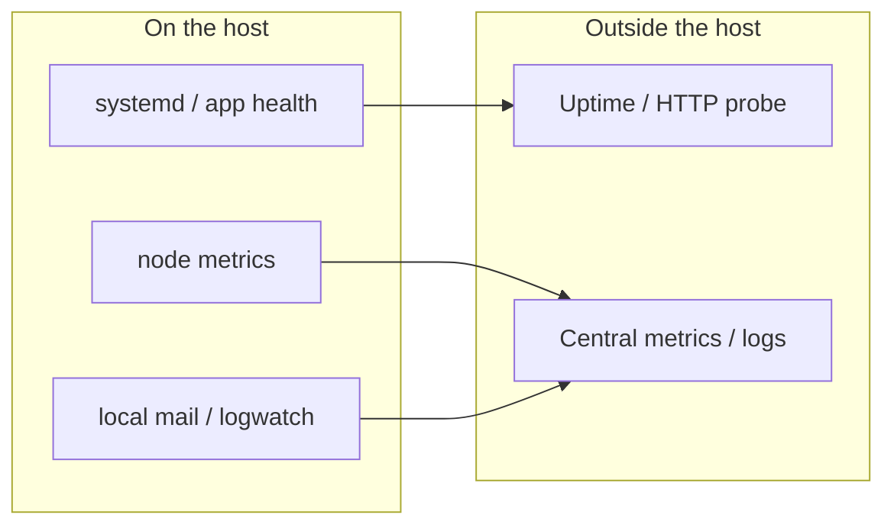

# Monitoring and healthchecks

## Threat

A hardened host that is **down**, **disk-full**, or **silently dropping mail** looks “secure” until customers notice. Host IDS (Fail2Ban, PSAD, Lynis mail) answers “are we under attack?” — not “is the service alive?”

## Do

Treat monitoring as a **layer beside** this kit, not inside Ansible by default. Wire three loops:



### 1) Uptime / black-box healthchecks (outside)

Probe from a **different network** than the server (SaaS uptime, a second VPS, or your CI runner with egress).

| Check | Example | Notes after hardening |
|-------|---------|------------------------|
| TCP open | `nc -zv HOST 443` | Only ports you **allow in** UFW |
| TLS + HTTP | `curl -fsS https://HOST/healthz` | App must expose a cheap path |
| SSH reachability | optional | Prefer **not** to probe SSH from the public Internet every minute |

Allowlist the probe source in Fail2Ban `ignoreip` and (if used) CrowdSec allowlists — same discipline as admin/VPN CIDRs.

Minimal self-hosted cron on a **watcher** box:

```bash
# /etc/cron.d/nowo-health-probe  (runs elsewhere, not on the target)
*/5 * * * * root curl -fsS --max-time 10 https://app.example.com/healthz >/dev/null \
  || echo "healthz failed $(date -u)" | mail -s "UPTIME app.example.com" security@example.com
```

### 2) On-host health (systemd / app)

Prefer unit-native checks over bespoke scripts when the app is a systemd service:

```ini
# drop-in fragment idea — adjust ExecStart to your stack
[Service]
Restart=on-failure
RestartSec=5

[Install]
WantedBy=multi-user.target
```

For containers or reverse proxies, expose `/healthz` or `/ready` that:

- Does **not** require auth
- Does **not** touch the database on every probe if a lighter liveness check exists
- Returns non-200 when dependencies you care about are dead (readiness vs liveness)

### 3) Metrics (optional, documented pattern)

If you run a metrics agent (Prometheus `node_exporter`, Netdata, Datadog agent, etc.):

1. Bind it to `127.0.0.1` **or** an admin VLAN — never `0.0.0.0` without auth.
2. Add an **explicit** UFW allow only if a remote scraper must pull (prefer push / VPN).
3. Re-test after `hidepid` / sysctl hardening — some agents break (see [kernel-and-sysctl](../04-host-baseline/kernel-and-sysctl.md)).
4. Put scraper IPs in Fail2Ban `ignoreip` if they hit SSH or auth endpoints.

Example bind for node_exporter (illustrative):

```bash
# Listen locally; scrape via SSH tunnel or reverse proxy with auth
node_exporter --web.listen-address=127.0.0.1:9100
```

### 4) What this kit already pushes (do not duplicate blindly)

| Signal | Source in this kit | Monitoring angle |
|--------|--------------------|------------------|
| Auth abuse | Fail2Ban mail | Keep; add rate dashboards if volume grows |
| Scan noise | PSAD / iptables log | Tune danger levels before paging humans |
| Package drift | unattended-upgrades / apticron | Alert on **failure**, not every success |
| Integrity | AIDE / rkhunter mail | Page on unexpected diffs only |
| Audit trail | auditd + logwatch | Digest is enough for small fleets |

### Minimum “production beyond harden” checklist

```text
[ ] External HTTP(S) or TCP probe with alert path tested once
[ ] Probe CIDRs in Fail2Ban ignoreip (and UFW if needed)
[ ] Disk / inode alert (df -h; agent or cron)
[ ] systemd failed units visible (systemctl --failed)
[ ] Mail path still delivers (kit msmtp test + monitoring of bounce)
[ ] Backup job success signal (out of band — not this repo)
```

## Why

Hardening reduces **how** you get owned. Monitoring reduces **how long** you stay broken or blind. Separating the two keeps this repository teachable and avoids shipping a second product (observability stack) inside Ansible.

## Verify

1. Stop the app service (lab only) → external healthcheck fires within your interval.
2. Restore service → alert clears.
3. Confirm the probe IP never appears in `fail2ban-client status sshd` bans.
4. `systemctl --failed` is empty on a healthy host.

## Rollback

Disable or delete the external monitor check; remove temporary UFW allows for scrapers; stop local exporters. Host hardening plays do not own these components.

## Next

[cicd-and-deploy.md](cicd-and-deploy.md) · [continuous-review.md](continuous-review.md)
