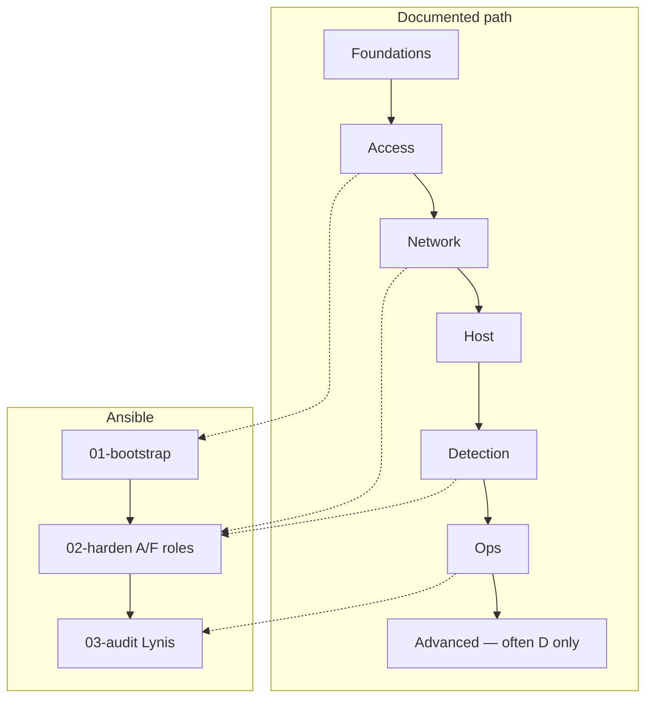

# Control coverage map

Starting **Debian VPS baseline** — not a compliance certification. Prefer understanding each control before enabling every flag.

Legend: **A** = automated (on by default) · **F** = automated behind a flag (off by default) · **D** = documented · **—** = intentionally omitted

| Control | Docs | Ansible | Notes |
|---------|------|---------|-------|
| Threat model & principles | D | — | Layer-0 reading |
| OS choice / lab prep | D | — | Debian 12/13 asserted |
| Admin user + intent groups | D | A | Password set `on_create` only |
| sudo / su limits | D | A | Passwordless sudo **off** by default |
| SSH keys, port, AllowGroups | D | A | Bootstrap vs runtime inventories |
| SSH key exclusive mode | D | F | `harden_ssh_keys_exclusive` (prod profile) |
| SSH crypto (Kex/Ciphers/MACs) | D | A | |
| SSH moduli trim | D | A | |
| SSH MFA TOTP (wired) | D | F | `harden_enable_mfa_role` + `nullok` |
| SSH MFA TOTP (enforced) | D | F | `nullok: false` + `harden_ssh_mfa_enable` |
| SSH FIDO2 hardware keys | D | — | Advanced; use exclusive keys after cutover |
| Password quality (pam_pwquality) | D | A | `/etc/security/pwquality.conf` |
| NTP / timesync | D | A | Debian 13 timesyncd vs ≤12 ntp |
| Unattended security upgrades | D | A | Auto-reboot **off** by default |
| apticron + apt-listchanges | D | A | |
| Kernel sysctl hardening | D | A | Includes kptr/dmesg/ptrace/link protect |
| AppArmor guidance | D | — | Advanced; enforce carefully |
| UFW default-deny in/out | D | A | |
| Fail2Ban sshd + mail actions | D | A | `action_mwl`; egress includes WHOIS/43 |
| Fail2Ban ignoreip required | D | A | Default on; lab profile relaxes |
| Lab / prod profiles | D | A | `harden_profile` asserted on harden |
| Refuse root harden inventory | D | A | Override: `harden_allow_root_harden` |
| Refuse vault `CHANGE_ME_*` | D | A | Asserted on harden |
| MFA coupling (role + nullok) | D | A | Asserted before sshd MFA enforce |
| Strict ops (mail/psad/lynis) | D | A | `harden_strict_ops` default on; lab off |
| PSAD (detect / alert) | D | A | LOG on `ufw-after-*` (non-accepted only) |
| PSAD AUTO_IDS (auto-block) | D | F | Opt-in |
| Dedicated iptables log + rotate | D | A | `[IPTABLES]` + `[UFW BLOCK]`; migrates off before-* |
| IPv6 UFW log hooks | D | A | `ufw6-after-*` |
| Docker vs UFW pitfalls | D | — | Doc only |
| CrowdSec alternative | D | — | Doc; one IPS at a time |
| msmtp outbound alerts | D | A | `0600` config + log file |
| ClamAV scoped nightly | D | F | `harden_clamav_scan_paths` |
| rkhunter | D | A | |
| chkrootkit | D | F | |
| AIDE integrity | D | F | `aide.db.new` → `aide.db` |
| auditd identity watches | D | A | Focused rules |
| logwatch digests | D | A | |
| Lynis via `03-audit.yml` | D | A | Debian packages by default |
| Third-party Lynis APT repo | D | F | Supply-chain opt-in |
| hidepid / umask / lock root / GRUB | D | — | Advanced optional |
| Firejail / deborphan / OSSEC | D | — | Advanced optional |
| Exim4 / duress / rng-tools | — | — | Omitted on purpose |

## Safer defaults (lab overrides)

| Variable | Production default | Lab profile |
|----------|--------------------|-------------|
| `harden_passwordless_sudo` | `false` | `true` |
| `harden_auto_reboot` | `false` | `true` |
| `harden_psad_auto_ids` | `false` | keep `false` |
| `harden_fail2ban_require_ignoreip` | `true` | `false` |
| `harden_strict_ops` | `true` | `false` |
| `harden_enable_clamav` / `aide` / `chkrootkit` | `false` | `true` |
| `harden_ssh_keys_exclusive` | `false` (prod profile `true`) | often `false` until cutover |

## Residual risks

- Focused auditd rules are not a full enterprise syscall pack.
- CrowdSec and Docker firewalling need human design.
- Physical/console threats remain operator-owned.
- Application security is out of scope.
